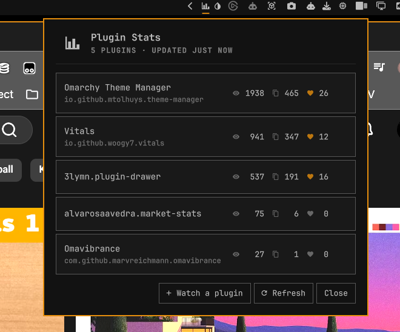

# Omapluginstats

Views, copies and hearts for a watchlist of plugins on the
[Omarchy plugin marketplace](https://plugins.omarchy.org), in a bar panel — and,
if you want one, on the bar itself as a split-flap departure board.



Add the plugin ids you care about — yours, or anyone's — and the panel shows
what the marketplace has recorded for each: how many people opened the listing,
how many views a day that averages since it was listed, how many copied its
install command, and how many hearted it. Rows are ranked by views, most-read
first.

## Install

```sh
omarchy plugin add https://github.com/marvreichmann/omapluginstats.git --enable
```

Then add `com.github.marvreichmann.omapluginstats` to your bar in
`~/.config/omarchy/shell.json`, or pick "Omapluginstats" from the bar widget
picker. The icon opens the panel. Nothing is shown on the bar itself until you
switch the ticker on.

## Using it

- **Watch a plugin** takes a plugin id — the `id` from its `manifest.json`,
  which is also what its marketplace listing shows and what
  `omarchy plugin add` installs it under. Enter adds it.
- Hover a row and use the bin icon to stop watching it.
- **Refresh** fetches the current numbers. Opening the panel does the same if
  the ones on screen are more than five minutes old.
- The speedometer column is **average views per day since listing** — total
  views divided by the days the listing has been up, counted inclusively. It is
  a lifetime average, not a recent trend: the marketplace publishes running
  totals and no history, so "views this week" is not something anyone can
  compute from it without recording the totals daily first.
- First-party `omarchy.*` plugins show a dash there. They ship with the shell
  rather than being listed, so there is no listing date to average over.
- An id the marketplace does not know shows dashes and *Not on the
  marketplace* — usually a typo, or a listing that has been retired.
- A watched plugin that is also installed is shown by name, with its id
  underneath. Everything else is shown by id, because names live in manifests
  and the stats API only knows ids.

## The bar ticker

Off by default. **Bar ticker** at the bottom of the panel turns it on, and it
then cycles the watchlist across the bar — one plugin at a time, name and
numbers, each character on its own drum of cards, flipping into place the way a
departure board does.

- **Flip the cards** and **Time between plugins**, under the switch, are the
  board's own two controls: whether each character turns over card by card, and
  how long a plugin stays up before the next one. With the cards flipping the
  slider will not go below the time the board needs to settle — about two
  seconds — because a shorter setting would change nothing.
- **Hover it and it stops**, so you can read the frame you leaned in for.
- **Scroll it** to step through the watchlist by hand.
- **Clicking it still opens the panel.**
- A number that has gone up since the last fetch is **tinted** for a minute or
  so, so a change catches your eye rather than needing to be noticed.
- A plugin that is not installed locally has no name to show, only its id, and
  a long id is shortened from the *left* — `com.github.you.yourplugin` becomes
  `YOURPLUGIN` rather than `COM.GITHUB.YO…`.
- On a **vertical bar** the ticker stays off. A board turned on its side is not
  a board; the panel is the whole feature there.

Switching it on is also the one thing that makes this plugin poll. The rest of
it fetches when you ask it to, but a board that is already on screen is no use
showing last night's numbers, so while the ticker is on the counts refresh every
15 minutes. That is the floor as well as the default: one request returns every
listing on the marketplace, at about 160 KB, and the setting below can make it
politer but not more frequent.

### Tuning it

The ticker's appearance is read from this widget's entry in
`~/.config/omarchy/shell.json`. All of it is optional:

```json
{
  "id": "com.github.marvreichmann.omapluginstats",
  "tickerQuietMotion": "roll",
  "tickerFields": ["views", "rate", "copies", "hearts"],
  "tickerNameChars": 14,
  "tickerUppercase": true,
  "tickerCards": true,
  "tickerFlapMs": 26,
  "refreshMinutes": 15
}
```

| Key | Default | What it does |
|---|---|---|
| `tickerQuietMotion` | `"roll"` | What the board does with **Flip the cards** switched off: `roll` slides the whole line up and the next one in behind it, `none` simply changes it. |
| `tickerFields` | all four | Which numbers appear beside the name: `views`, `rate`, `copies`, `hearts`. They are always drawn in that order. |
| `tickerNameChars` | `14` | How much of the name is shown before it is truncated. 4 to 40. |
| `tickerUppercase` | `true` | Capitals, the way a departure board has them. `false` keeps names as written, at the cost of a longer drum and a slower settle. |
| `tickerCards` | `true` | Draw a card behind each character. `false` leaves the seam and the motion on a flat bar. |
| `tickerFlapMs` | `26` | How long one card takes to turn. 8 to 250 — lower is a faster, noisier board, and it also sets how fast the board can change plugin at all. |
| `refreshMinutes` | `15` | How often the numbers are fetched while the ticker is on. 15 is the minimum. |

The three things you are most likely to want to change — whether the ticker is
on, whether it flips, and how long a plugin stays up — are deliberately *not*
here. They are switches in the panel, kept in this plugin's own state file, so
reaching for one never rewrites your `shell.json`.

## What it talks to

One endpoint for the counts, read-only:
`GET https://api.omarchyplugins.com/v1/stats`, which returns them for every
listing on the marketplace in a single response. The watchlist is applied on
this machine, so the marketplace is never told which plugins you are interested
in.

Listing dates come from the public catalog at
`https://plugins.omarchy.org/catalog.json`, and only when a watched plugin has
no date yet — a listing date never changes, so it is cached for good. Most
sessions never fetch it at all.

This plugin never posts to `/v1/events` — the endpoint the website uses to
*record* a view, a copy or a heart. Reading your numbers here does not change
them, for your plugins or anyone else's.

Nothing else leaves the machine. The watchlist, the ticker's three switches,
and the last numbers fetched are kept in
`$XDG_STATE_HOME/omarchy/omapluginstats.json` so the panel opens with something
to show before the next fetch returns.

The stats request repeats on a timer only while the ticker is on, and stops the
moment it is switched off.

## Removing it

```sh
omarchy plugin remove com.github.marvreichmann.omapluginstats
```

Then take the widget out of your bar in `~/.config/omarchy/shell.json` if it is
still listed there. The plugin writes exactly one file of its own, which is left
behind and can go too:

```sh
rm ~/.local/state/omarchy/omapluginstats.json
```

Nothing else on the system is touched — no other configuration is written, no
services are installed, and nothing is left running.

## Requirements

- Omarchy 4.x with the Quickshell bar
- `curl`, `grep`, a POSIX `sh` and coreutils (`head`, `wc`, `mktemp`, `stat`,
  `mv`, `timeout`) on `PATH` — all part of a base Arch install. `curl` fetches
  the two documents above; `grep` narrows the catalog before it is parsed. `sh`
  and coreutils run a small wrapper around each fetch that enforces a hard size
  limit — 1 MB for the stats, 16 MB for the unpacked catalog — and discards the
  response entirely if it runs past it, so a misbehaving server cannot make the
  shell hold an unbounded amount of data.
- Local files go through the same kind of wrapper. The state file and the
  watched plugins' `manifest.json` files are read only if they are regular
  files you own, not symlinks or hard links, and no larger than 96 KB and
  64 KB. The state file is written by renaming a fresh file into place, so a
  symlink at its path is replaced rather than written through. A state file
  that fails those checks is neither read nor overwritten, and the panel says
  that changes are not being saved.

No other external dependencies, and no accounts, keys or tokens: both sources
are public and read anonymously.

## License

MIT — see [LICENSE](LICENSE).
